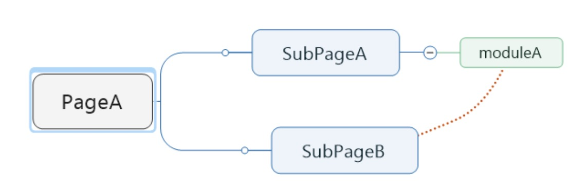

### 提取公用代码

* 减少代码冗余
* 提高加载速度

#### CommonsChunkPlugin
* 只需要在webpack.config.js中配置即可

    ```
    plugins:[ new webpack.optimize.CommonsChunkPlugin(option) ] } 

    其中的option是 
    options.name or options.names 表示chunk名称   
    options.filename 公用代码文件名    
    options.minChunks 可以是数字（出现次数），函数（自定义逻辑），特殊值（不会打包任何模块） options.chunks （提取代码范围）
    options.children 是否从子模块中查找依赖
    options.deepChildren 
    options.async （创建一个异步的公共代码流）
    ```

    
